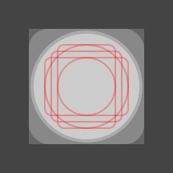

# ⚠️⚠️⚠️ This repo just fork [react-native-svg-app-icon](https://github.com/aeirola/react-native-svg-app-icon) and remove icon shadow.

## Installation

```bash
yarn add -D react-native-svg-app-icon-without-shadow
```

## Usage

Place your square 108x108 SVG app icon file named `icon.svg` in the project root and run

```bash
npx react-native-svg-app-icon-without-shadow
```


----

# react-native-svg-app-icon

<p align="center">
  
  
  
  
</p>


CLI tool for generating all the necessary iOS and Android application launcher icons for React Native projects from a single SVG source file. Features include:

- iOS PNG icon generation
- Android 8.0, and higher, vector drawable adaptive icon generation with PNG fallback
- Android 7.1 legacy circular icon generation
- Android 7.0, and lower, legacy square icon generation

For more information about the generated files, see the [docs](docs/generated_files.md).

:curly_loop: If you also want to use SVG images within your React Native application, you might want to check out [react-native-svg-asset-plugin](https://github.com/aeirola/react-native-svg-asset-plugin).

## Installation

```bash
npm install --save-dev react-native-svg-app-icon
```

SVG rendering handled by the splendid [`sharp`](https://github.com/lovell/sharp) library, meaning no dependencies outside of npm is required.

Requires node version 10, or later.

## Usage

Place your square 108x108 SVG app icon file named `icon.svg` in the project root and run

```bash
npx react-native-svg-app-icon
```

This will generate all the required icons under the `android/` and `ios/` directories.

### Icon background

If you want to use a separate background layer for Android adaptive icons, or because your source icon file doesn't contain a background, you can create an `icon-background.svg` file which will be used as the background layer for the generated icons.

In case you want to produce both foreground and background layers from a single SVG file, you can use [svg-deconstruct](https://github.com/not-fred/svg-deconstruct) to split layers to separate files. See configuration section below on how to specify input file paths.

## Configuration

Behaviour can be configured in the `app.json` under the `svgAppIcon` field. For example if you want to store icon layers under an `icon/` directory, you might want to use:

```json
{
  "name": "example",
  "displayName": "example",
  "svgAppIcon": {
    "foregroundPath": "./icon/icon-foreground.svg",
    "backgroundPath": "./icon/icon-background.svg",
    "platforms": ["ios"]
  }
}
```

Supported configuration values are

| Field            | Default                   | Description                                                                                                                                                     |
| ---------------- | ------------------------- | --------------------------------------------------------------------------------------------------------------------------------------------------------------- |
| `foregroundPath` | `"./icon.svg"`            | Input file path for the foreground layer. File needs to exist, and may contain transparency.                                                                    |
| `backgroundPath` | `"./icon-background.svg"` | Input file path for the background layer. File doesn't need to exist, and will default to a fully white background. If file exist, it needs to be fully opaque. |
| `platforms`      | `["android", "ios"]`      | Array of platforms for which application launcher icons should be generated. Possible values are `android` and `ios`.                                           |

## Icon format

The input icon should be a SVG file adhering to the [Android adaptive icon specification](https://developer.android.com/guide/practices/ui_guidelines/icon_design_adaptive). Specifically, the image should:

- Be a valid SVG image
- have a 1:1 aspect ratio
- Have a size of 108x108dp

of which the:

- Center 72x72dp square is the normally visible area
- Center 66dp diameter circle is the safe area which will always be visible

With the various icons cropped according to the following image



-  Overflow area
-  Visible area
-  iOS / Android legacy square crop
-  Android legacy circular crop
-  Safe area
-  Icon keylines

For an example icon file, see [`example/icon.svg`](example/icon.svg).

## Rationale

React Native aims to provide tools for building cross platform native mobile applications using technologies familiar from web development. Since the core tooling doesn't provide a solution for building the laundher icons for those applications, this tool aims to fill that gap.

Luckily, most icons follow a similar structure of a foreground shape on a background, which is easily adapted to different shapes and sizes. This is the idea behind Android [Adaptive Icons](https://developer.android.com/guide/practices/ui_guidelines/icon_design_adaptive), and what the [Android Image Asset Studio](https://developer.android.com/studio/write/image-asset-studio) implements nicely for generating leagy icons. This tool can actually be though of as a NPM CLI port of the Image Asset Studio, with added support for generating iOS icons as well.

### Other work

Most existing solutions are centered around the idea of scaling PNG images.

- [Expo](https://docs.expo.io/versions/latest/guides/app-icons/): Scales PNG files generating the required iOS and Android variants, but requires users to supply platform specific PNGs in order to adhere to platform icon design guidelines.
- [app-icon](https://github.com/dwmkerr/app-icon): Similar to Expo, with some added features such as labeling the icons. Requires imagemagick.

## Troubleshooting

### Supported SVG features

Most common SVG features are supported, including masks and styles. The underlying SVG rendering library is [`librsvg`](https://developer.gnome.org/rsvg/stable/rsvg.html) which claims to support most SVG 1.1 features, excluding scripts, animations and SVG fonts.

## Future improvements

- Add generation of Android notification icons
